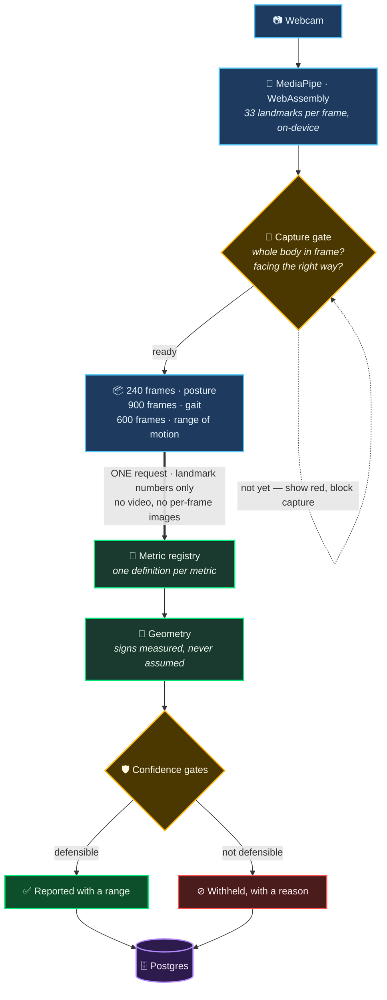

<div align="center">

<br/>

# 🦴 Kinetiq

### **Clinical posture, gait & range-of-motion screening from an ordinary webcam**

*A patient stands in front of a laptop, holds four poses, walks across the frame,*
*then moves each joint as far as it will go. A few minutes later a clinician has measured*
*spinal alignment, gait timing and joint range — with an honest statement of how much*
*each number can be trusted.*

<br/>


<br/>


<br/>

</div>

---

## 🎯 The problem

A physiotherapist assessing posture today reaches for a goniometer, a plumb line and a
trained eye. It takes twenty minutes, it needs the clinician physically present, and two
clinicians measuring the same patient will disagree.

Neura-AI measures the same quantities from a webcam in ninety seconds.

> [!IMPORTANT]
> The hard part is **not** extracting body landmarks — a pre-trained model does that.
> The hard part is knowing **which of the resulting numbers a clinician can act on**,
> and saying so out loud. That question runs through the whole of this codebase.

---

## ⚙️ How it works



**Pose estimation runs in the browser, not on the server.** Each patient's own device
does the vision work, so the server does none of it — no GPU bill, no video upload, no
network round-trip between frames. A frame of landmark numbers is roughly **20× smaller**
than the JPEG it came from.

The backend never sees video. It receives numbers and does geometry on them.

---

## 📊 What it measures

<table>
<tr>
<td width="33%" valign="top">

### 🧍 Posture

**4 captures** · front, left, right, back
60 frames each

| | |
|---|---|
| Reportable | **13** |
| Carry a normal range | **10** |

Trunk lean · shoulder & pelvic obliquity ·
head tilt · hip & knee angles ·
frontal knee alignment · leg-length asymmetry

*Where the body rests.*

</td>
<td width="33%" valign="top">

### 🚶 Gait

**3 captures** · front, left, right
5 s walk each @ 60 fps

| | |
|---|---|
| Reportable | **14** |
| Carry a normal range | **9** |

Cadence · stride time · stance/swing/double-support ·
stride length · walking speed ·
peak knee & hip flexion · trunk lean · step width

*How the body moves through a cycle.*

</td>
<td width="33%" valign="top">

### 📏 Range of motion

**10 holds** · front, left, right
3 s end-range hold each

| | |
|---|---|
| Reportable | **11** |
| Carry a normal range | **11** |

Shoulder flexion & abduction · elbow flexion ·
hip flexion · knee flexion ·
cervical side bend — **each side measured separately**

*How far a joint will go.*

</td>
</tr>
</table>

> [!TIP]
> **Range of motion reports left and right side by side, and never averages them.**
> A shoulder reaching 170° on one side and 120° on the other is the finding; two numbers
> sitting inside their normal range individually is exactly how that finding is missed.
> The comparison is shown **without a threshold** — what counts as a meaningful
> side-to-side difference depends on the joint and the patient, and no cited cutoff
> exists for these measurements.
>
> Its normal ranges are **floors, not bands**: falling below is the finding.

> [!NOTE]
> **A metric's definition lives in exactly one place** — the registry
> (`backend/app/core/metrics/`). Unit, normal range, citation, required view and physical
> bounds are declared once; the calibrator, the API and the report all derive from that.
>
> Before the registry existed, a definition was spread across the computation, the
> database column and a hardcoded range in the React report — which is how a trunk angle
> that always returned ~180° came to be graded against a "0–5°" range and badged
> **`Severe` for every patient.**

---

## 🔬 Accuracy — how we know the numbers are right

Most of this project is the answer to one question: ***how do you know?***

<table>
<tr><td>

### 1️⃣ &nbsp; Synthetic ground truth

A parametric skeleton is posed at **known** joint angles, projected through a **known**
camera, and fed to the **production** calibrators in the exact payload shape the browser
sends. There is no measurement uncertainty to argue about — any disagreement is a defect.

```bash
python backend/scripts/metric_accuracy_report.py
```

</td></tr>
<tr><td>

### 2️⃣ &nbsp; Certification

A Monte-Carlo population — randomised heights, postures, walking speeds, camera
distances, frame sizes, landmark noise and capture rates — reports **what fraction of the
numbers we would ship land within each metric's tolerance.**

```console
$ python backend/scripts/certify_accuracy.py --trials 150

  CERTIFIED at >=96%    26 metrics      ← posture + gait
  BELOW BAR              0

$ python backend/scripts/certify_rom.py --trials 150

  CERTIFIED at >=96%    11 metrics      ← range of motion
  BELOW BAR              0
```

A metric that cannot clear the bar **is not shipped**. It is withheld with a reason, or
stripped of its normal range so it can be read but never used as a verdict.

> [!IMPORTANT]
> **Certification alone cannot catch a definition that is wrong self-consistently.**
> Truth is derived from the same geometry the metric reads, so a sign inversion certifies
> at 100% while telling every clinician the patient bends the other way. Cervical side
> bend did exactly that, and three further defects hid behind it — a synthetic skeleton
> whose head translated with the trunk but stayed bolted to the horizon, a reference that
> **added** a shoulder shrug to the measured range, and a pelvis whose own tilt passed
> through at 1:1.
>
> So each metric is *also* pinned against the **posed** angle — the number a clinician
> would have typed into a goniometer — in `core/pose/test_rom_v2.py`. Certification
> proves a metric survives noise and projection. Only a definitional test proves it is
> measuring the right thing.

</td></tr>
<tr><td>

### 3️⃣ &nbsp; Repeatability

Accuracy says how close one measurement is to the truth. **Repeatability says whether two
measurements of the same unchanged patient agree** — which is the number the product
actually needs, because *"compare to last visit"* is the feature clinicians reach for.

Each subject is screened several times with camera placement, distance and noise re-drawn
between sessions and the subject held fixed, yielding a **minimal detectable change**:
the smallest difference distinguishable from measuring twice.

```console
$ python backend/scripts/repeatability.py --subjects 30 --sessions 4

  TRACKS CHANGE         34
  SINGLE READING ONLY    4   ← never allowed to drive a progress claim
```

This matters most for range of motion, because *"how much further does the shoulder go
than last visit"* **is** the ROM result. All 11 ROM metrics track change, with a minimal
detectable change under **1.3°**.

</td></tr>
</table>

> [!WARNING]
> ### 4️⃣ &nbsp; Clinical validation — **not yet done**
>
> Everything above is **computational** correctness: the arithmetic is right *given the
> landmarks*. It does not prove the landmarks sit in the right place on a real body.
> Clothing, body shape, lighting and skin tone all move them, and no synthetic harness
> can see that.
>
> `clinical_validation.py` is the harness for closing the gap — it emits a collection
> sheet with the bedside reference method per metric, then scores completed data with
> Bland-Altman limits of agreement and ICC. It needs ~15–20 subjects and a goniometer.
>
> **Until that study runs, the honest claim is "validated against synthetic ground
> truth", not "clinically validated."**

---

## 🛡️ Honesty by construction

The interesting engineering is what the system does when it **cannot** measure something.
Four mechanisms, each the response to a real defect:

<table>
<tr>
<td width="50%" valign="top">

#### ⊘ Nothing is fabricated

A metric carries a value it can defend, or `null` plus a reason.

<sub>The previous implementation returned `stride_time 1.0`, `stride_length 0.3`, cadence
clamped into range and stance 60/40 on detection failure — a complete, fictional metric
set that looked like a healthy walk.</sub>

</td>
<td width="50%" valign="top">

#### 🧭 Every sign is measured, never assumed

Anterior from toe-ahead-of-heel. Handedness from shoulder ordering. Vertical from
shoulders-above-hips.

<sub>Looking these up from a view label is how three frontal metrics shipped reading
~178° on live captures.</sub>

</td>
</tr>
<tr>
<td width="50%" valign="top">

#### ⚖️ Opposing views are averaged, not discarded

Camera roll and subject yaw bias front and back in **opposite** directions, so the mean
cancels the error outright.

<sub>Picking one view reported a value wrong by half the disagreement.</sub>

</td>
<td width="50%" valign="top">

#### 🚫 No verdict without the precision to support one

If measurement error is wider than the normal range, the badge reports noise rather than
the patient.

<sub>Those metrics keep their number and lose their verdict — enforced in the registry so
no client can re-add it.</sub>

</td>
</tr>
</table>

---

## 🚀 Getting started

### Prerequisites

| | |
|---|---|
| 🟩 **Node** | 18+ (20+ recommended) |
| 🐍 **Python** | 3.9+ |
| 🐘 **Postgres** | any; the project uses [Neon](https://neon.tech) |
| 🌐 **Browser** | Chrome or Edge — MediaPipe needs WebAssembly + `getUserMedia` |

### ⚛️ Frontend

```bash
cd frontend
npm install
npm run dev                        # → http://localhost:5173
```

### 🐍 Backend

```bash
cd backend
python3 -m venv .venv
source .venv/bin/activate          # Windows: .venv\Scripts\activate
pip install -r requirements.txt

cp .env.example .env               # then fill it in ↓
prisma generate
prisma migrate deploy

uvicorn app.main:app --reload      # → http://localhost:8000
```

📖 Interactive API docs at **`http://localhost:8000/docs`**

### 🔐 Environment

| Variable | What it is |
|---|---|
| `DATABASE_URL` | Postgres connection string |
| `SECRET_KEY` | JWT signing key — generate a fresh random value |
| `AWS_ACCESS_KEY_ID` / `AWS_SECRET_ACCESS_KEY` | SES, for transactional email |

> [!CAUTION]
> **`backend/.env` must never be committed.** These credentials were committed to this
> project's history at one point and had to be purged. If you are picking this up from an
> older clone, **rotate them before doing anything else** — a key that has been in a git
> history is compromised whether or not anyone noticed.

---

## 🧪 Running the tests

```bash
cd backend  && python -m pytest app -q         # 818 tests, NO database required
cd frontend && npm test
```

The backend suite needs **no database**. Every test either fakes it or does not touch
it, which is what lets CI gate on all 818.

Two suites genuinely need one and are opt-in, because they assert against seeded data
rather than against the code:

```bash
RUN_DB_INTEGRATION_TESTS=1 python -m pytest app -q   # 859 tests, needs a database
```

> [!CAUTION]
> Point `DATABASE_URL` at a **disposable** database before running those. They were
> previously not opt-in, and they create users with hardcoded phone numbers and never
> deleted them — so they ran against production, wrote rows there, and then failed on
> the unique phone constraint for every run afterwards. Thirty of the forty user rows
> in that database were left behind by the test suite. The phone numbers are now unique
> per run and every row is deleted afterwards, by exact match rather than by pattern.

| Suite | What it guards |
|---|---|
| 🎯 `core/validation/test_harness.py` | every metric against known ground truth |
| 🧨 `core/validation/test_edge_cases.py` | degenerate captures — *"should there be a number at all?"* |
| 📏 `core/pose/test_rom_v2.py` | joint angles against the **posed** angle — sign, reference frame, and what must *not* leak in |
| 🔐 `api/posture/test_service.py` | authorisation, screening credits, and that a credit is spent **atomically** |
| 🔐 `api/gait/test_service.py` | authorisation, screening credits, capture-rate handling |
| 🔐 `api/rom/test_service.py` | the same, plus **which metrics a given hold is allowed to report**, and the payload contract |
| 🌐 `api/rom/test_routes.py` | request validation, auth on every endpoint, the `{data: …}` envelope the client unwraps |
| 🚦 `frontend/src/lib/captureOrientation.test.ts` | the browser-side stance gate |
| 🧭 `frontend/src/lib/romMovements.test.ts` | the capture script — sides named, views that can see them |
| 🔗 `frontend/src/app/Router.navigation.test.tsx` | every screening card reaches a real, protected route |
| 📐 `frontend/src/components/rom/ROMMetricsDisplay.test.tsx` | the left/right comparison, and that it carries **no** threshold |
| 💳 `frontend/src/pages/ROMAnalysisPage.test.tsx` | one screening credit per assessment, however the capture behaves |

Edge cases are covered adversarially: empty captures, a frozen subject, a treadmill walk
with no translation, `NaN` landmarks, tracking dropouts, portrait phones, mislabelled
views, landmarks collapsed to a point, holds too short to be steady, joints posed from
full range down to severely restricted, and a subject who faced the wrong way. Every one
asserts the same invariant —

> **a metric is never shipped *and* wrong.**

---

## 📁 Project layout

```
backend/
├── app/
│   ├── api/              FastAPI routes & services — auth, bookings, posture, gait, ROM, payments
│   └── core/
│       ├── metrics/      🧭 the registry — one definition per metric, tolerances, MDC
│       ├── pose/         🧍 posture calibrator · 📏 range-of-motion calibrator
│       ├── gait/         🚶 gait analyser & event detection
│       ├── geometry/     📐 shared primitives with documented sign conventions
│       └── validation/   🔬 synthetic skeleton, camera model, walk generator, harness
├── scripts/              📊 accuracy report · certification · repeatability · clinical validation
└── prisma/               🗄️ schema & migrations

frontend/
└── src/
    ├── components/       capture flows (posture · gait · ROM), metric report, PDF templates
    ├── lib/              MediaPipe integration, capture session, orientation gate, movement script
    └── types/            metric payload contract shared with the backend
```

---

## ⚠️ Known limitations

*Stated plainly, because a screening tool that overstates itself is worse than one that
does less.*

**🔴 Not clinically validated.** The harness is built; the study is not run.

**🟠 11 of the 24 declared posture metrics are withheld**, for four distinct reasons —
each recorded in the registry alongside the metric:

| Reason | Metrics | What would unlock it |
|---|---|---|
| 🦴 Needs a palpated bony landmark | pelvic tilt · Q-angle ×2 · subtalar pronation ×2 · shoulder protraction | physical markers placed by a clinician — no camera finds ASIS, PSIS, the patella or the calcaneal axis |
| 📏 Needs depth | head yaw · foot progression ×2 | a second calibrated view, or a depth camera |
| 📉 Measures noise, not anatomy | thoracic kyphosis | landmarks *on* the thoracic curve — a flexicurve or inclinometer |
| ♻️ Superseded | knee flexion at neutral | nothing; the knee angles measure it properly |

**🟡 A better pose model would not help.** Measured, not assumed: a **twelve-fold**
improvement in landmark precision moves the in-plane metrics further inside tolerances
they already clear. The transverse plane needs *depth*, and doubling a model's accuracy
does not reach it — only real 3-D does.

```bash
python backend/scripts/certify_accuracy.py --jitter 0.25   # reproduce the sweep
python backend/scripts/certify_accuracy.py --world-error 0.003
```

**🟡 Four metrics cannot track change over time.** Repeat-session agreement is too poor
to support a progress claim, and they are marked so the UI will not make one.

**🟡 Gait needs 60 fps.** Below ~55 fps the knee's extension trough is briefer than one
frame and its range of motion cannot be recovered. The capture requests 60 and sends the
rate it *actually achieved*, which the backend re-derives from frame timestamps rather
than trusting.

**🟡 Range of motion measures a held position, not a movement.** The patient moves the
joint as far as it goes and holds while frames are collected, which is why ROM reuses the
posture capture path unchanged — the visibility gate, the orientation gate, the frame
budget and the confidence gates all apply as-is. What it therefore does **not** measure
is anything about the *path*: velocity, smoothness, or the point along the arc where pain
begins.

**🟡 ROM is active range, unassisted, standing.** Published reference values are usually
taken supine or with an examiner stabilising the joint. Standing hip flexion in particular
is limited by balance rather than by the joint, so its floor is set lower than the
textbook figure and the metric is more useful for **symmetry** than for absolute range.

**🟡 Cervical rotation cannot be measured** and is declared unsupported rather than
estimated. It is a transverse-plane movement: rotation about the vertical axis moves a
landmark toward or away from the lens instead of across it, so the measurement would rest
entirely on MediaPipe's inferred depth. The posture registry's `head_rotation` is the same
quantity and certifies at **25.5° of error** against a ±8° normal range. The arithmetic is
implemented and exact on clean landmarks; what is missing is a second calibrated view.
